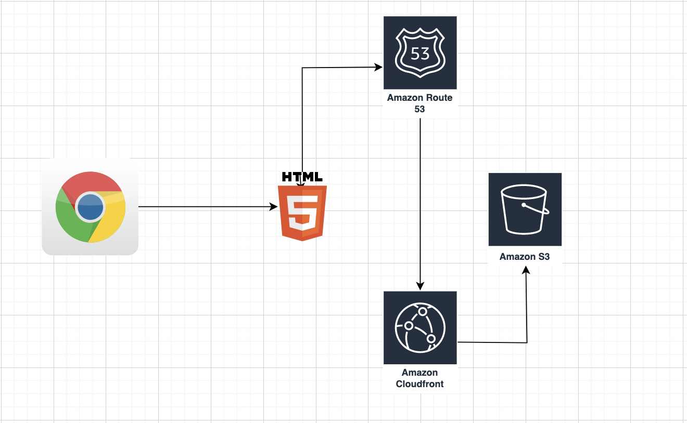

# Adeytrends - Hosted on AWS

##### Adeytrends is a fashion/tech brand I started at the age of 17 with the aim of building tools for the fashion communnity.

##### Check out the [website](https://www.adeytrends.com)

In the image above the application points to a DNS entry on Route53, which points to the Amazon CloudFront distribution which points to the S3 bucket that contains the website files.
#### Explanation of AWS tool used?

**Amazon S3-** S3 is a storage bucket that stores all the website files.

**Amazon Route53-** Route53 is a DNS that holds the right to the domain name. Hosted zones were created - this defines servers that you route traffic to as name spaces. The name spaces defined in the hosted zones need to be the same as that for your domain.

**Amazon Certificate Manager-** ACM was used to create a custom SSL certificate which was linked to the Cloudfront distribution. This allows to enable https.

**Amazon CloudFront-** CloudFront is a CDN that caches the data from S3 in multiple Edge locations. This is good because it imporves performance and allows the webpage to have https(secure connection).

#### Next steps

- Use Github actions to set up a Continous Deployment workflow to store the files in an S3 bucket and clear the cached data on CloudFront- this allows it to repull all the data from S3 and not use cached data.